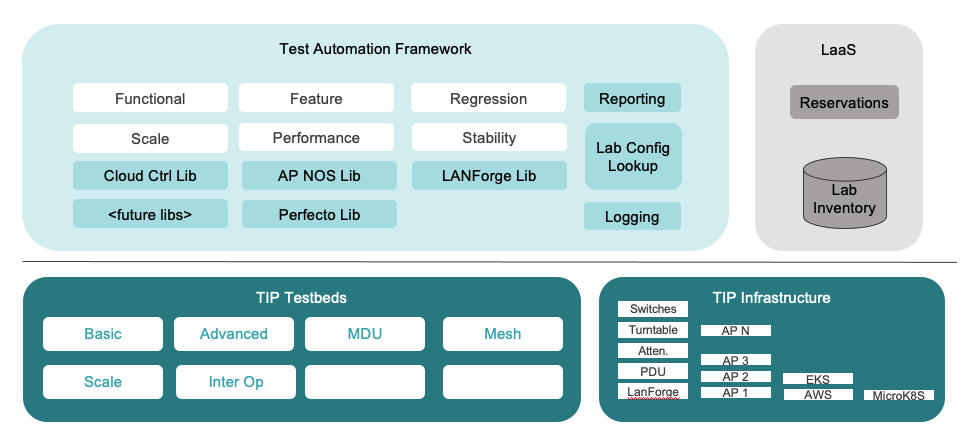
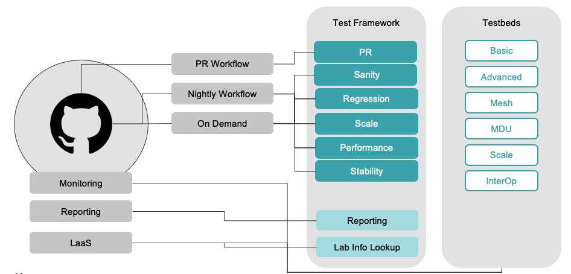

## TIP Open WiFi Test Automation

### Overview

This repository contains the test automation framework and scripts for TIP Open WiFi.
Test Framework is implemented in pytest



The vision is to create an open test framework to ensure production grade Open Wifi Solution.

This test automation tied into our overall tooling at TIP as shown below:



You can get the full list of tests on [GitHub Pages](https://telecominfraproject.github.io/wlan-testing/) that's updated automatically.

### General guidelines

This testing code adheres to generic [pep8](https://www.python.org/dev/peps/pep-0008/#introduction) style guidelines, most notably:

1. [Documentation strings](https://www.python.org/dev/peps/pep-0008/#documentation-strings)
2. [Naming conventions](https://www.python.org/dev/peps/pep-0008/#prescriptive-naming-conventions)
3. [Sphynx docstring format](https://sphinx-rtd-tutorial.readthedocs.io/en/latest/docstrings.html)

Using [pytest](https://docs.pytest.org/en/6.2.x/) as the test execution framework.

Using [pylint](http://pylint.pycqa.org) for code quality monitoring.

We are using the `pylint` package to do the linting. Documentation for it can be found [here](http://pylint.pycqa.org/en/latest/).
In general, the customizations are possible via the `.pylintrc` file:

1. Line length below 120 characters is fine (search for max-line-length)
2. No new line at the end of file is fine (search for missing-final-newline)
3. Multiple new lines at the end of file are fine (search for trailing-newlines)
4. Indent using 4 spaces (search for indent-string)

In future we should enforce a policy, where we cannot merge a code where the pylint scoe goes below 7:

```shell
pylint --fail-under=7 *py
```

the command above would produce a non-zero exit code if the score drops below 7.

### TIP Controller Integration

Using Swagger Autogenerated CloudSDK Library pypi package (implemented with [swagger codegen](https://github.com/swagger-api/swagger-codegen)).

### Reporting

Currently we use the [pytest allure integration](https://docs.qameta.io/allure/#_pytest) to create visual reports for the test outcomes.

Additionally we generate overview pages, e.g. like [this one](http://openwifi-allure-reports.s3-website-us-east-1.amazonaws.com/sanity/overview/) to consolidate multiple test reports of the same test type.

These overview pages are being deployed by [this workflow](.github/workflows/update-overviews.yml) and their configuration is set in [this file](./.allure-overview/overviews.json).

### Miscellaneous

1. Do not use old style string formatting: `"Hello %s" % var`; use `f"Hello {var}` instead
2. use `"""` in Docstrings

### Useful links

https://docs.pytest.org/en/latest/example/markers.html  
https://docs.pytest.org/en/latest/usage.html  
http://pythontesting.net/framework/pytest/pytest-introduction/

### Test status


[](https://github.com/Telecominfraproject/wlan-testing/actions/workflows/quali.yml)


[](https://github.com/Telecominfraproject/wlan-testing/actions/workflows/interop.yml)


[](https://github.com/Telecominfraproject/wlan-testing/actions/workflows/performance.yml)


[](https://github.com/Telecominfraproject/wlan-testing/actions/workflows/quali-advanced.yml)


[](https://github.com/Telecominfraproject/wlan-testing/actions/workflows/regression.yml)


[](https://github.com/Telecominfraproject/wlan-testing/actions/workflows/interop_performance.yml)


### Best Practice

1. Ensure to have a python version > 3
2. We strongly recommend to use virtualenv to ensure that your dev environment sandbox is created.

### Code style

All code must be written in python 3 and conform to PEP 8 style guide. The test framework is built using pytest.  

[](https://www.python.org/)
[](https://www.python.org/dev/peps/pep-0008/)  

### Directory Structure

```bash
├── lanforge              - /* to be migrated */
├── libs
│   ├── controller_tests  -/* Library Support for controller_tests part  */
    ├── apnos             -/* Library Support for Access Points (uses AP SSH)  */
│   ├── lanforge          -/* Library Support for LanForge Traffic Generator */
│   ├── perfecto          -/* Library Support for Perfecto Systems */
│   ├── testrails         -/* Result Visualization (will be depreciated ) */
├── tests                 -/* Pytest cases Directory */
│   ├── _basic_test_setup
│   ├── access_point_tests
│   ├── controller_tests
│   ├── e2e
      ├── advanced
      ├── basic
      ├── interOp
      ├── mdu
      |── mesh
      |── scale
    |── README.md         -/* Pytest framework and testcases information */
```

# Test Automation Setup Instructions 
```
# Let's assume '~/automation' directory for setting wlan-testing
cd ~/
mkdir automation
cd automation

git clone https://github.com/Telecominfraproject/wlan-testing 
cd wlan-testing/

cd tests/
vim lab_info.json    # Setup your testbed data info here
docker build -f docker/Dockerfile -t wlantest .
docker run -i -t -v $(YOUR_ALLURE_RESULT_DIR):/allure-results wlantest -c “cd tests;pytest -m ‘marker’ -s -vvv –testbed=basic-testbed –alluredir=allure-results”


# Check List of Available Tests
https://telecominfraproject.github.io/wlan-testing/

# Test Suites Marker
ow_sanity_lf: OpenWifi Sanity Test Plan


# List of Available Markers

client_connectivity_tests: Client Connectivity Test Cases with bridge|nat|vlan modes across 2.4|5|6 GHz bands with Various Encryptions
dfs_tests: Dynamic Frequency Selection Test Cases
multi_psk_tests: Multi PSK Test Cases
rate_limiting_tests: Rate Limiting Test Cases
dvlan_tests: Dynamic VLAN Test Cases
dynamic_qos_tests: Dynamic QOS Test Cases
multi_vlan_tests: Multi VLAN Combination based Test Cases
client_scale_tests: Client Capacity Tests with maximum possible Stations bridge|nat|vlan 2.4|5|6 GHz Bands
peak_throughput_tests: Single Client Peak Performance Test with various Bandwidths across 2.4|5|6 GHz Bands with various Client Types
dataplane_tests: Single Client Throughput Test with various pkt sizes with UL|DL|BI with AC|AX Client Types across 2.4|5|6 GHz Bands
country_code: Country Code Test Cases 

# Supported Modes, Bands, Encryptions
bridge: Use this marker to run bridge mode tests in each of the above test plans/suites
nat: Use this marker to run nat mode tests in each of the above test plans/suites
vlan: Use this marker to run vlan mode tests in each of the above test plans/suites

twog: Use this marker to run 2.4 GHz tests in each of the above test plans/suites
fiveg: Use this marker to run 5 GHz tests in each of the above test plans/suites
sixg: Use this marker to run 6 GHz tests in each of the above test plans/suites

open: Use this marker to run open Encryption tests in each of the above test plans/suites
wpa: Use this marker to run wpa Encryption tests in each of the above test plans/suites
wpa2_personal: Use this marker to run wpa2_personal Encryption tests in each of the above test plans/suites
wpa3_personal: Use this marker to run wpa3_personal Encryption tests in each of the above test plans/suites
wpa3_personal_mixed: Use this marker to run wpa3_personal_mixed Encryption tests in each of the above test plans/suites
wpa_wpa2_personal_mixed: Use this marker to run wpa_wpa2_personal_mixed Encryption tests in each of the above test plans/suites

wpa_enterprise: Use this marker to run wpa_enterprise Encryption tests in each of the above test plans/suites
wpa2_enterprise: Use this marker to run wpa2_enterprise Encryption tests in each of the above test plans/suites
wpa3_enterprise: Use this marker to run wpa3_enterprise Encryption tests in each of the above test plans/suites
wpa_wpa2_enterprise_mixed: Use this marker to run wpa_wpa2_enterprise_mixed Encryption tests in each of the above test plans/suites
wpa3_enterprise_mixed: Use this marker to run wpa3_enterprise_mixed Encryption tests in each of the above test plans/suites

# for visualizing allure reports, Install nodejs
# Set Java home

# install allure command
npm install -g allure-commandline --save-dev
```
<<<<<<< HEAD
### [Test Plans and Markers](TEST_PLANS.md):bookmark_tabs:
=======

>>>>>>> WIFI-10529
### Executing and Contributing new test cases

Follow instructions provided [here](./tests/README.md)  to understand the Testing Framework, and How to run and 
write new tests

### Issue Reporting
Please submit issues using our JIRA project [here](https://telecominfraproject.atlassian.net/browse/WIFI)

Use the Test Automation [backlog](https://telecominfraproject.atlassian.net/secure/RapidBoard.jspa?projectKey=WIFI&rapidView=48&view=planning.nodetail)
